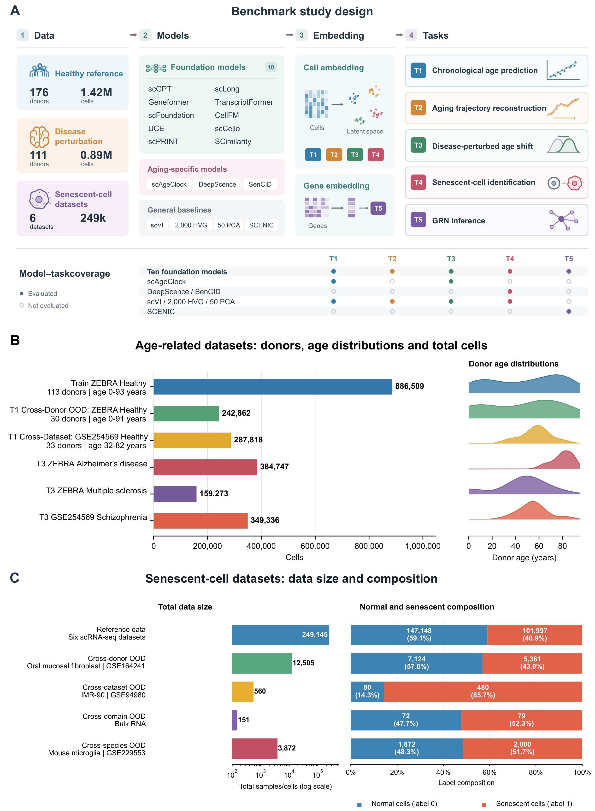

# Benchmarking single-cell foundation models for aging biology

This benchmark evaluates how single-cell foundation models capture aging-related information in cell and gene representations. It compares ten foundation models with aging-specific methods and conventional baselines across five tasks: chronological-age prediction, age-associated trajectory reconstruction, disease-associated age shifts, senescent-cell identification, and regulatory-edge recovery. Evaluations span human and mouse data, with validation across donors, datasets, experimental domains and species where applicable. Together, these tasks assess the predictive utility, generalization and biological information of pretrained representations across complementary aspects of aging.



**Figure 1. Benchmark design and dataset composition for evaluating single-cell foundation models in aging.** Overview of the datasets, models, representations and five evaluation tasks.

## Code overview

| Task | Code |
|---|---|
| 01 Age prediction | [Model extraction, training and prediction](01_age_prediction/README.md) |
| 02 Age trajectories | [Monocle 3 workflow](02_age_trajectory/README.md) |
| 03 Disease age shifts | [Age-prediction reuse and comparison](03_disease_age_shift/README.md) |
| 04 Senescence identification | [Embedding extraction and classification](04_senescence_identification/README.md) |
| 05 Regulatory networks | [Gene-embedding extraction](05_regulatory_network/README.md) |

[00_shared](00_shared/README.md) contains preprocessing, baseline, evaluation and optional downstream workflows. [06_cross_task_summary](06_cross_task_summary/README.md) recalculates summary rankings and regulatory-edge statistics from the bundled processed inputs.

## Data and requirements

Expression and gene-embedding inputs are in the sibling `../aging_benchmark_data/` directory. Model scripts require their model-specific environments, pretrained resources, original model-repository helper scripts and configured input paths. Original training splits and selected model checkpoints are not bundled. Task 1 CellFM training and scAgeClock code, and Task 4 DeepScence/SenCID code, are not available in this collection.

## Usage

For the CPU summary workflow, use Python 3.10:

```bash
python -m pip install -r requirements-lock.txt
python 06_cross_task_summary/reproduce.py
```

This command recalculates T1-T4 summaries from supplied tables and T5 AP/AUROC/bootstrap statistics from supplied scores; it does not train models. Outputs are written to `outputs/reproduced/`. `file_manifest.csv` lists the delivered files and SHA-256 hashes.
